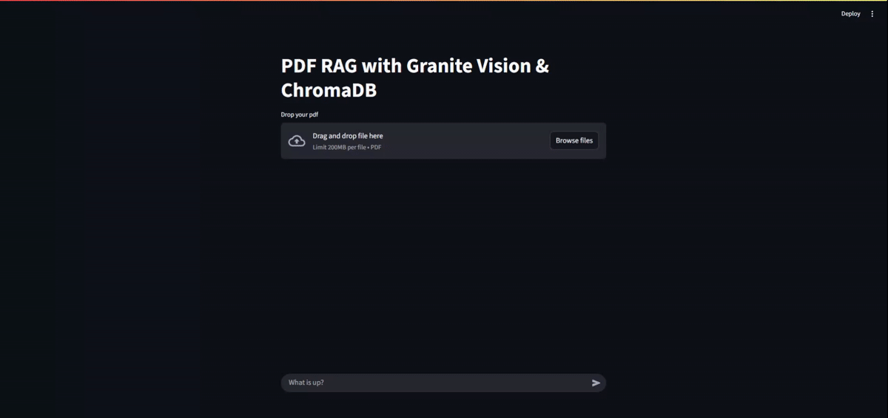

# Multimodal PDF RAG Chatbot


Users can upload a PDF, and the system will intelligently retrieve relevant information from both the text and the visual content to provide accurate, context-aware answers.




## Key Features

-   **Multimodal Processing:** Extracts and understands both text and images from PDF files.
-   **Image Understanding:** Utilizes a vision model (LLaVA) to generate rich, semantic descriptions of images, making visual data searchable.
-   **Retrieval-Augmented Generation (RAG):** Employs a vector database (ChromaDB) to find the most relevant text chunks and image descriptions to answer user queries.
-   **Local LLMs:** Powered by local language models via Ollama, ensuring privacy and control over the models used.
-   **Interactive UI:** A user-friendly and responsive chat interface built with Streamlit.

## Tech Stack

-   **Backend & Orchestration:** Python, LangChain
-   **Frontend:** Streamlit
-   **LLM Serving:** Ollama
-   **Models:**
    -   **Generation:** `gemma3:latest` (or any other powerful chat model)
    -   **Vision:** `gemma3:latest` (for image description)
    -   **Embeddings:** `granite-embedding:latest`
-   **Vector Database:** ChromaDB
-   **PDF Processing:** PyMuPDF (`fitz`)

## How It Works

The application follows a two-stage RAG pipeline:

#### 1. Ingestion Pipeline
When a user uploads a PDF:
1.  **Content Extraction:** Text and images are extracted from each page using PyMuPDF.
2.  **Image Description:** Each extracted image is passed to a vision model (LLaVA) which generates a detailed text description of its content.
3.  **Chunking:** The extracted text and the generated image descriptions are split into smaller, manageable chunks.
4.  **Embedding & Storage:** These chunks are converted into vector embeddings and stored in a ChromaDB vector database, creating a searchable knowledge base of the document.

#### 2. Retrieval and Generation Pipeline
When a user asks a question:
1.  **Query Embedding:** The user's query is converted into a vector embedding.
2.  **Similarity Search:** The system performs a similarity search in ChromaDB to find the most relevant text chunks and image descriptions.
3.  **Context-Aware Prompting:** The retrieved context is combined with the original query into a prompt for the final generation model.
4.  **Answer Generation:** The language model (Gemma) generates a human-like answer based on the provided context.
5.  **Display:** The answer is streamed back to the user in the chat interface.

## Setup and Installation

1.  **Clone the repository:**
    ```bash
    git clone https://github.com/Ajeets6/multi-modal-RAG.git
    cd multi-modal-RAG
    ```

2.  **Install Python dependencies:**
    ```bash
    pip install -r requirements.txt
    ```

3.  **Install and Run Ollama:**
    -   Pull the required models from the command line:
        ```bash
        ollama pull gemma3:latest
        ollama pull granite-embedding:latest
        ```

4.  **Ensure Ollama is running** in the background.

## Usage

Run the Streamlit application from your terminal:

```bash
streamlit run src/main.py